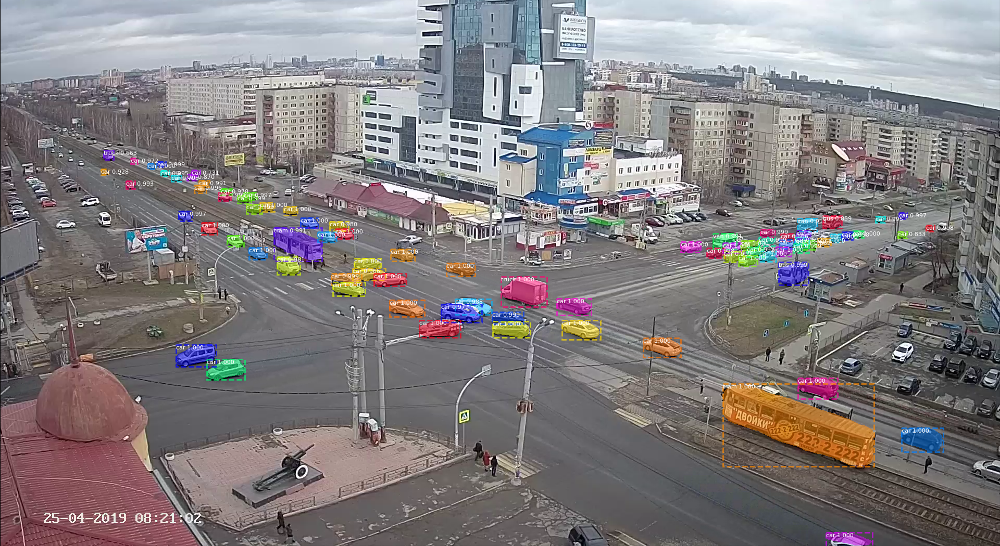

This repository contains all source codes relevant to the "Detection and tracking of vehicles with data from a video surveillance camera in the task of estimating traffic flow based on deep convolutional neural networks" research paper. 
We used official 
[Detectron realization](https://github.com/facebookresearch/maskrcnn-benchmark/tree/f917a555bc422ed5e06a402e739da0e21b00d0b5) 
from Facebook as a start point. Here is an example of how implemented system works at [day](examples/day.mp4) and at 
[night](examples/night.mp4)(better to download and open in local video player). 
If you are interest in the dataset and/or our trained models, please email us(canxes@mail.ru, nikolskaiaki@susu.ru).

One should not consider provided sources as an off-the shelf implementation. It is not a production-ready solution and 
still only a draft of what can be achieved with modern convolutional networks in the field of traffic analysis. 
Provided project is intended to serve as a complete reference about implementation details and neural network 
architecture/hyperparameters.

Short summary of the most relevant directories and files:
- **traffic/models** - config files for used models. Start from here if you are interest in the precise architecture 
of the detection network.
- **traffic/utils** - drawing procedures, model inference and other utils.
- **tracking** - sources for SORT tracker, tracking script. **Uses GPLv3 license**.  
- **traffic/scripts/plot_predicts.py** - run trained model on a small video fragment to get 
per frame rendered predictions. Be aware that pretty matplotlib rendering takes time.
- **traffic/scripts/parse_is_archives.py** - API calls to download and concat video fragments from is74 archive, 
this archive was used as our main data source in the work. Requires login and password to access.

Refer to the **maskrcnn_benchmark/modeling** for realization of the feature aggregation pooling and focal loss. 

Note, that one should be careful with absolute paths in [config](traffic/models) files and *[path_catalog.py](traffic/paths_catalog.py)*. 
In addition, many scripts in this repository should be run block-by-block rather than in a console mode.  

We also provide pre-trained weights for our best model and small video fragment for inference. 
To run the model and render predictions use the following commands:  

```bash
# Directory for results
mkdir /tmp/traffic-analysis-inference
cd /tmp/traffic-analysis-inference
# Fetch, build and run dockerfile
wget https://raw.githubusercontent.com/alnfedorov/traffic-analysis/master/docker/Dockerfile
docker build -t traffic-analysis . 
docker run -v /tmp/traffic-analysis-inference:/inference -it --name traffic-analysis traffic-analysis 

# In Docker container - Predict - Track - Render
cd /traffic-analysis
python3.6 /traffic-analysis/traffic/scripts/predict_video.py --image-mask="/traffic-analysis/traffic/mask.png" \
    --config-file="/traffic-analysis/traffic/models/R-50-FPN-1280x512-CustomAnchors-FocalLoss-CascadeMax/config.yaml" \
    --video-file="/traffic-analysis/examples/night_raw_example.mp4" \
    --save-to="/inference/predicts.pth"

python3.6 tracking/track_predicts.py --predicts-file="/inference/predicts.pth" \
                                     --image-regions="/traffic-analysis/tracking/cross-road-regions.png" \
                                     --save-to="/inference/tracklets.pth"

# Takes time
python3.6 traffic/scripts/plot_tracklets.py --video-file="/traffic-analysis/examples/night_raw_example.mp4" \
                                            --tracklets="/inference/tracklets.pth" \
                                            --save-to="/inference"
```
